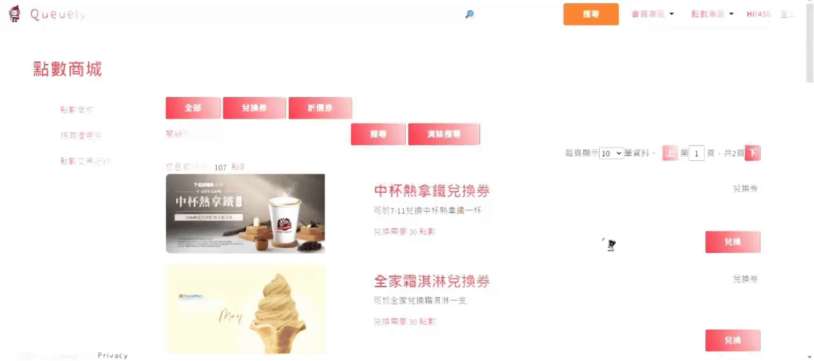
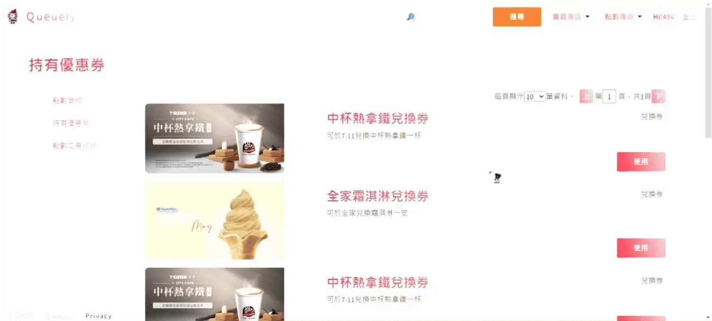
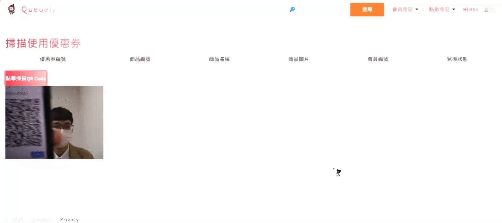
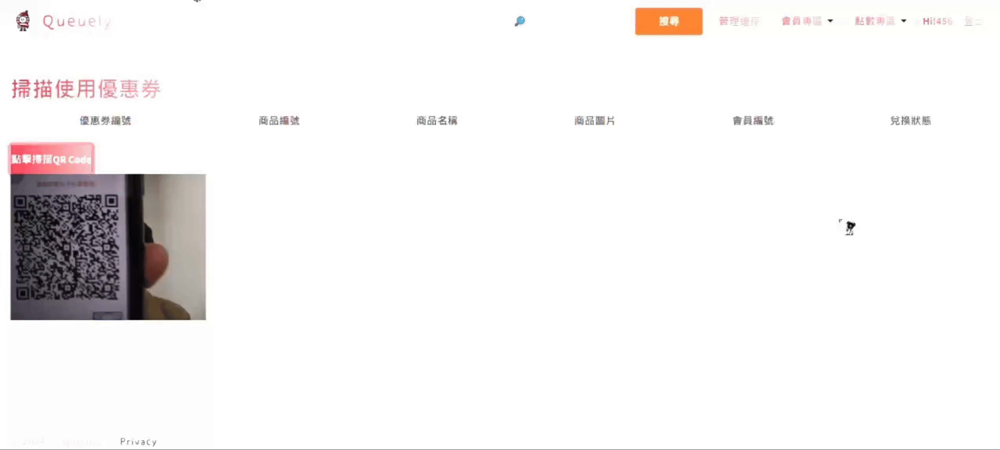
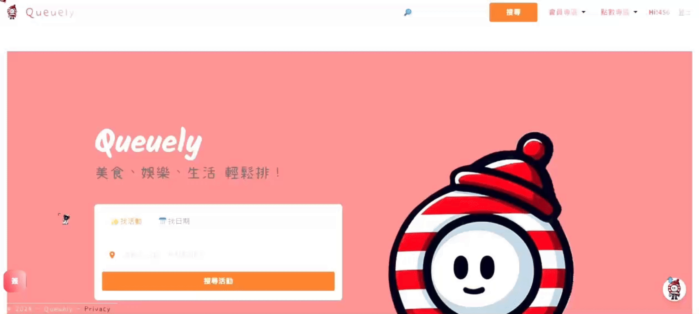
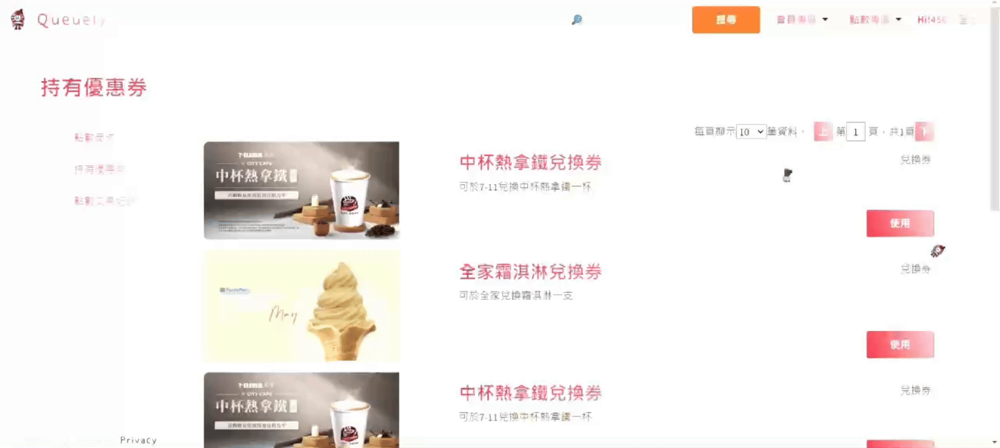
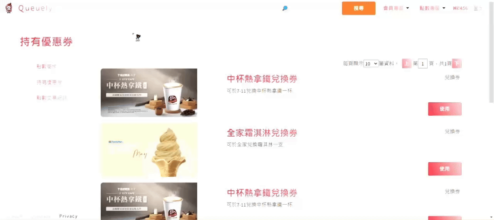
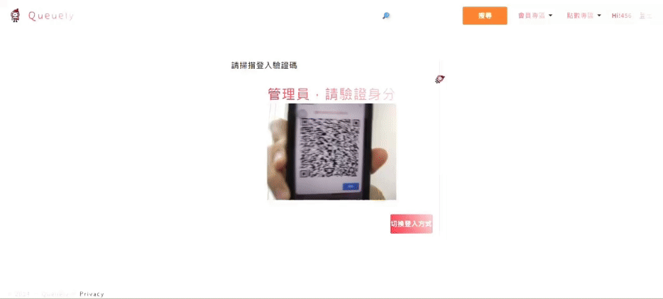

# Queuely

## 目錄

1. [專案介紹](#專案介紹)
2. [團隊成員與負責項目](#團隊成員與負責項目)
3. [技術棧](#技術棧)
4. [安裝與運行](#安裝與運行)
5. [功能展示](#功能展示)
6. [未來展望](#未來展望)

## 專案介紹

Queuely是一個提供活動宣傳和報到服務的整合平台。
一般使用者-可以在我們平台搜尋有興趣的活動並報名參加，提前計畫行程，豐富生活更加便利。
活動舉辦方-可以藉由我們平台上傳活動，並提供事先報名及現場簽到的服務，減少現場混亂，提高運營效率。

## 團隊成員與負責項目

### 湯其霖 [](https://github.com/fanrir556)

領導小組、統整意見及決策、專案開發時程管理、專案整合、使用者活動登記頁面、主辦方活動簽到頁面、活動資訊頁面、後台管理頁面開發

### 周郁慈 [](https://github.com/yucichou)

一般會員註冊登入、收藏清單、首頁、搜尋功能、Azure雲端架設

### 邱泓穎 [](https://github.com/tohousanae)

廠商會員登入註冊、修改廠商資訊、活動CRUD、圖片上傳功能優化

### 施和融 [](https://github.com/twins0angel)

點數商城、每日簽到、小遊戲、優惠券、配色更改、管理者登入

## 技術棧

- **前端**：Vue.js, MVC, CSS, JavaScript, jQuery, Bootstrap
- **後端**：MVC, ASP.NET Core
- **資料庫**：Microsoft SQL Server, Entity Framework Core 8
- **雲端平台**：Azure
- **版本控制**：Git

## 安裝與運行

### 後端 (ASP.NET Core Web API)

1. 進入 `Seatly1` 資料夾：

   ```bash
   cd Seatly1
   ```

2. 恢復 NuGet 套件：

   ```bash
   dotnet restore
   ```

3. 運行應用：

   ```bash
   dotnet run
   ```

## 功能展示

1. [會員系統](#會員系統)
2. [活動方系統](#活動方系統)
3. [點數專區](#點數專區)
4. [小遊戲與簽到](#小遊戲與簽到)
5. [管理員登入](#管理員登入)

### 會員系統

### 活動方系統

### 點數專區

#### 會員介面

1. 依照持有點數兌換優惠券



2. 使用優惠券，顯示QR Code給合作活動方



3. 轉場動畫


#### 活動方介面(優惠券使用)

1. 優惠券使用失敗



2. 優惠券使用成功



#### 管理員介面

1.CRUD及登入時載入動畫


### 小遊戲與簽到

1. 每日簽到



2. Queuely在哪裡小遊戲



3. logo彩蛋小遊戲



### 管理員登入

1. QR Code登入



2. 密碼登入


## 未來展望

- 優化前後端性能，縮短響應時間
- 採用Vue跟WebAPI做前後端分離開發，以元件化開發簡潔程式碼、優惠使用者體驗
